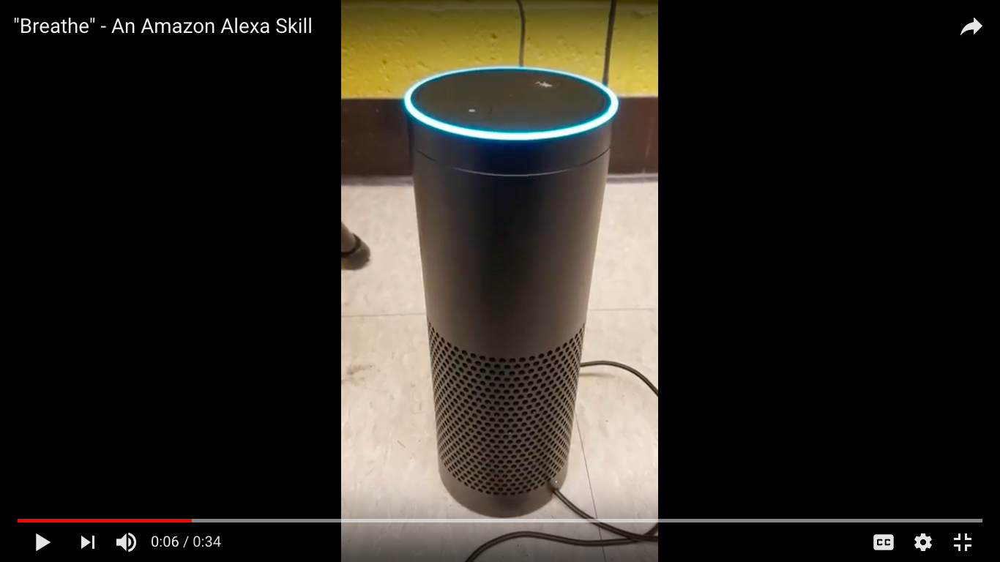

# What is Breathe?

Breathe is an Alexa skill that is focused on celebrating your successes. It is an extremely personal skill that utilizes your successes and good moments in your life by magnifying them through repetition and reminding you of them. The main idea behind this skill comes from the fact that as people we dwell on our failures more than we celebrate our successes. Success is this strange, unattainable ceiling that people seem to believe they will never truly reach, but I don't agree with that.

We need to celebrate every success in our lives, no matter how big or how small. Sometimes just getting out of bed is a success and that is awesome! We should feel good about ourselves for that. There should be no shame or guilt. So many apps about goal reaching or success nowadays are guilt focused. Not this one. This one is about you, your success, and the importance of recognizing that success in your life.

### Check our demo video:

# Why breathe?

This skill is good for EVERYONE. We need to stray away from guilt tripping and weird ideas of success and allow ourselves to celebrate us and what we are doing. People participating in rehab or physical therapy could utilize this app as well to celebrate each step of their journey. Sometimes people are told making it to the end of the journey is the only success, but every step completed is also a success, and we have to remember that.

#### This project is made at [SpartaHack 17](https://17.spartahack.com/).
